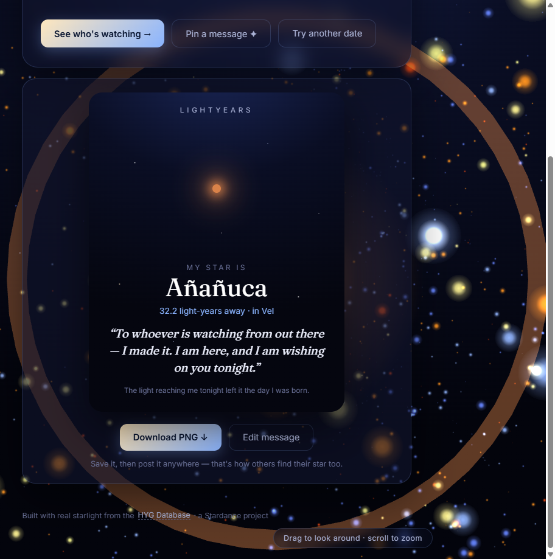
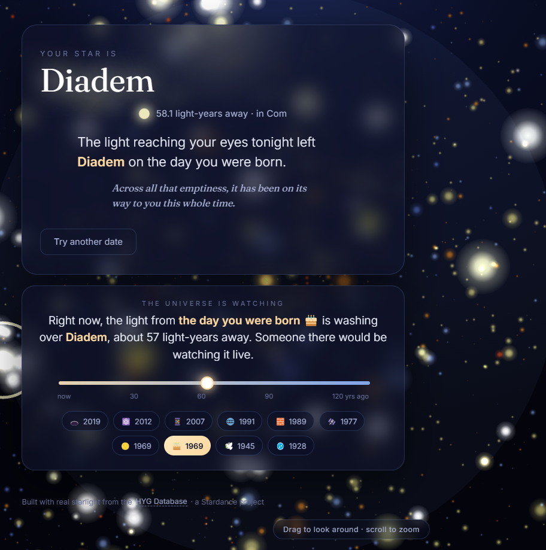

# Devlog — Lightyears

A running log of building **Lightyears**, a love letter from the night sky.
Reverse-chronological: newest entry on top.

---

## Phase 4 — Starposts + Share Cards 📌

> Pin a message to your star, then download a share card you'll actually want to post.

Lightyears now has a viral engine. After it finds your star, hit **"Pin a
message ✦"** and write something — a note to your future self, a wish, a hello
to whoever's watching from out there. Your note is saved locally (keyed by the
star's name), so coming back to the same birthday brings it right back. Zero
backend, works offline.

Then: **"Make my share card →"**. You get a gorgeous portrait card — the
Lightyears wordmark, your star glowing in its real colour over a mini
starfield, its name and distance, and your message set in an italic serif.
One tap on **Download PNG** rasterises it (at 2× for crisp social posts) and
saves it. Post it anywhere, and the next person finds their star too.

**Notes from the build**

- `js/starpost.js` — localStorage persistence (per star), the composer logic,
  and a lazy `import('html-to-image')` so a CDN hiccup never breaks the rest
  of the app.
- The card is just a styled DOM node — what you preview is exactly what gets
  rasterised, so it always matches.
- One gotcha worth flagging: `html-to-image` needs to *read* the font CSS to
  embed the serif into the PNG, which trips a cross-origin error on Google
  Fonts. Adding `crossorigin="anonymous"` to the font `<link>` fixed it — the
  Fraunces serif now embeds cleanly and the console is silent.
- Graceful everywhere: empty message → the card just drops the quote; private
  mode → sharing still works for the session; 180-char cap with a live counter.

---

## Phase 3 — "The Universe Is Watching" 🛸

> Drag a slider through Earth's history and watch our light reach the stars.

This is the one that breaks people's brains a little.

Here's the idea. Light is slow. A star **57 light-years away** is, *right now*,
catching the light that left Earth **57 years ago** — in 1969, the year we
landed on the Moon. So if someone were standing on a planet around that star
tonight, pointing a good enough telescope back at us, they'd be watching the
Moon landing **live**. Not a recording. Live.

Lightyears now lets you feel that. After it finds your birthday star, hit
**"See who's watching →"** and a timeline opens up. Drag the slider and:

- The 3D galaxy lights up the **shell of stars at that exact distance** — a
  glowing band of suns, with a faint sphere marking the radius.
- A headline names the moment those stars are seeing right now:
  *"Right now, the light from the first Moon landing 🌕 is washing over
  **Diadem**, about 57 light-years away. Someone there would be watching it
  live."*
- Real moments are pinned as chips — the first flight, penicillin, the Moon
  landing, the first iPhone, the first photo of a black hole...
- **Your own birthday gets pinned too**, so you can see which stars are
  watching the day you were born.

The numbers are real, straight from the HYG star catalog. Born in 1969?
Your birthday chip sits right next to the Moon-landing chip, and the same
shell of stars is watching both. That coincidence lands every time.

**Under the hood**

- `js/timeline.js` — curated events, the `years-ago → light-years → parsecs`
  math, nearest-named-star lookup, and the live headline copy.
- `js/galaxy.js` — a custom point shader now takes `uShellR` / `uBandWidth` /
  `uShellBoost` uniforms, so brightening the right band of ~8,800 stars while
  dragging is just a uniform update (no geometry rebuilds — buttery smooth).
- The whole thing is a progressive enhancement: no WebGL, no timeline, but the
  flat "find your star" experience still works.

Try it with a birthday you care about. Then tell a friend that somewhere out
there, a real star is watching the day they were born.

---

## Phase 2 — The 3D Galaxy 🌌

Find your star, then *fly* to it. Phase 2 turned the flat result card into a
real Three.js starfield: ~8,800 real stars positioned by their actual
coordinates, colored by temperature, sized by brightness. When you find your
star the camera glides across the dark to meet it, and a soft glow + pulsing
ring marks it among its neighbors. Drag to look around, scroll to zoom.

---

## Phase 0 + 1 — Find Your Star ⭐

The first ship. Enter your birthday, and Lightyears turns your age into
light-years and finds the real star whose light has been travelling toward you
for exactly that long. Built on the HYG v4.1 catalog, trimmed down to a lean
JSON of the stars worth showing. Dark, cinematic, mobile-first.
